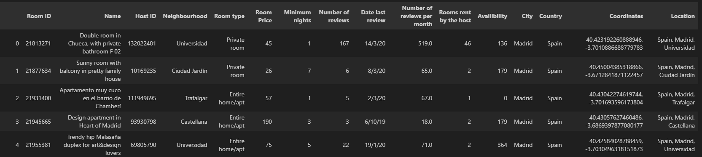
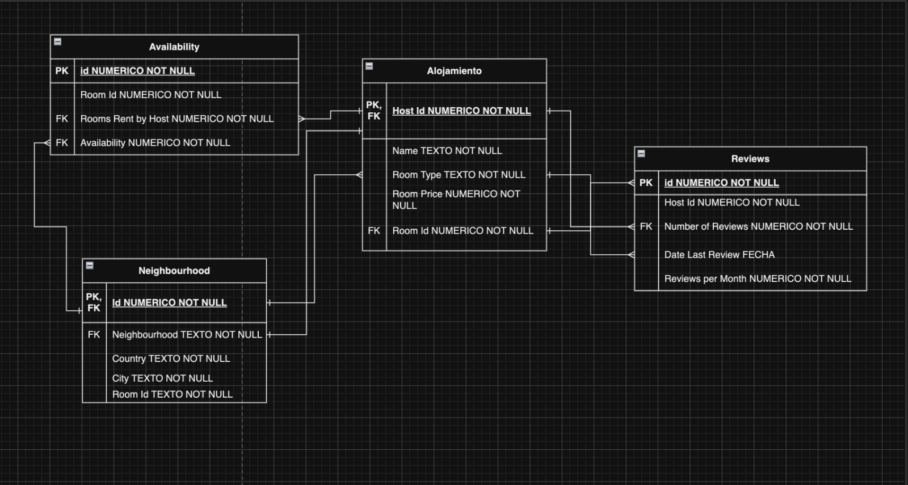
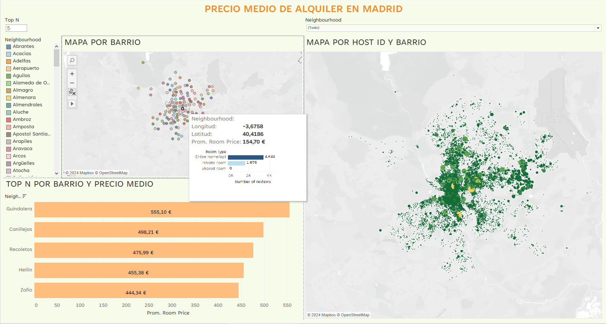

# Análisis de Datos de Airbnb en Madrid

Este proyecto es el trabajo final del curso de especialización "Women in Tech II", enfocado en la formación en Big Data con un énfasis particular en el análisis de datos. 
## Tabla de Contenidos
* [Visión general](#visión-general)
* [Pasos Realizados para Completar el Proyecto](#pasos-realizados-para-completar-el-proyecto)
* [Herramientas y Tecnologías](#herramientas-y-tecnologías)
* [Configuración](#configuracion)
* [Conclusiones y Lessons Learned](#conclusiones-y-lessons-learned)
* [Autoras](#autoras)

## Visión General
Este proyecto tiene como objetivo analizar e interpretar un conjunto de datos obtenido de Airbnb. Los principales objetivos incluyen familiarizarse con el conjunto de datos, arquitectar y validar los datos, realizar un análisis exploratorio, visualizar métricas a través de un panel de control, implementar un algoritmo de regresión para predecir los precios de las propiedades y presentar los hallazgos en un informe exhaustivo.
## Pasos Realizados para Completar el Proyecto

### Arquitectura y Validación de los Datos
**Muestreo y Exploración Inicial de los Datos**
   - Realizamos un muestreo inicial para obtener una visión general de los datos disponibles. 
   - Eliminamos los datos de alojamientos que no pertenecían a Madrid y la columna que indicaba la fecha de la última actualización, ya que era uniforme en todas las entradas. Conservamos las entradas con valores nulos en la columna de revisiones para mantener la integridad de los datos para el modelo de predicción de precios de alojamiento. Puedes revisar el código de este proceso en el documento - **"Validación de datos.ipynb"**.

**Definir e Implementar el Datawarehouse**
   - Diseñamos y definimos la estructura del Datawarehouse para almacenar los datos. 
   - Para crear la base de datos con los datos filtrados se puede utilizar el siguiente codigo: **"Script MySQL creación DB.txt"**
### Análisis Exploratorio
   - Analizamos la calidad de los datos identificando inconsistencias, errores y valores faltantes.
   - Detectamos outliers utilizando rangos de variables y tratamos los valores nulos mediante técnicas de imputación adecuadas.
   - Creamos boxplots, histogramas y otras visualizaciones para entender la distribución y características de los datos.
   Los resultados de este paso están en el documento - **"Analisis exploratorio y modelos predicción.qmd"**.

### Visualización de las Métricas
   - Diseñamos un dashboard en Tableau para visualizar las métricas y KPIs, respondiendo a preguntas clave sobre los datos.
   - Implementamos vistas interactivas y utilizamos campos calculados avanzados para mejorar la funcionalidad del dashboard.
   
Se puede encontararlo completo en **"Dashboard.twbx"**.
### Pre-procesamiento y Modelado

   - Preparamos los datos para el modelado, realizando las transformaciones necesarias y asegurando la limpieza de los datos.
   - Desarrollamos un algoritmo de regresión lineal para predecir el precio de un inmueble basado en las características seleccionadas.
El analisis detallado de este paso esta en **"Informe.pdf"**.

## Herramientas y Tecnologías
- Lenguajes de Programación: Python, R, SQL
- Bibliotecas de Análisis de Datos: Pandas, NumPy, tidyverse, dplyr, ggplot2, tidyr, glmnet, caret
- Herramientas de Visualización: Tableau, Draw.io

## Configuración
- El dataset del proyecto es [éste](https://public.opendatasoft.com/explore/dataset/air-bnb-listings/export/?disjunctive.neighbourhood&disjunctive.column_10&disjunctive.city&q=Madrid&location=7,40.5931,-4.422&basemap=jawg.light). Hay que exportarlo en formato CSV.
- Python: Asegúrate de tener instalado Python en tu sistema. Puedes descargarlo desde [python.org](https://www.python.org/) o utilizar un entorno de desarrollo como Anaconda.
- R: Instala R desde [r-project.org](https://www.r-project.org/) y un IDE como RStudio desde [su página principal](https://posit.co/download/rstudio-desktop/) para un entorno de desarrollo conveniente.
- SQL: PostgreSQL.
- Tableau: Descarga e instala Tableau desde [tableau.com](https://www.tableau.com/es-es/products/desktop/download).

    
## Conclusiones y Lessons Learned

**Impacto de variables**: El vecindario y el tipo de habitación tienen un impacto significativo en el precio de los alojamientos de Airbnb.

**Precisión del modelo**: El modelo de regresión lineal mostró un buen ajuste y las predicciones fueron razonablemente precisas, aunque hay margen para mejorar el manejo de datos y la selección de métricas.

**Importancia de la limpieza de datos**: La calidad de los datos es fundamental para el rendimiento del modelo. Mejorar la limpieza y el preprocesamiento de datos puede llevar a modelos más precisos. 

## Autoras

- [Patri García](https://github.com/pgarcgarc)
- [Marina Sindreu Riba](https://github.com/msindreu)
- [María Rodriguez Abad](https://github.com/MariaRgezAbad)
- [Yana Tolstobrova](https://github.com/yana-tolstobrova)
- [Natalia Gil Espallargas](https://github.com/Nataliage)
- [Ana Yepes Triana](https://github.com/Anayepes)

